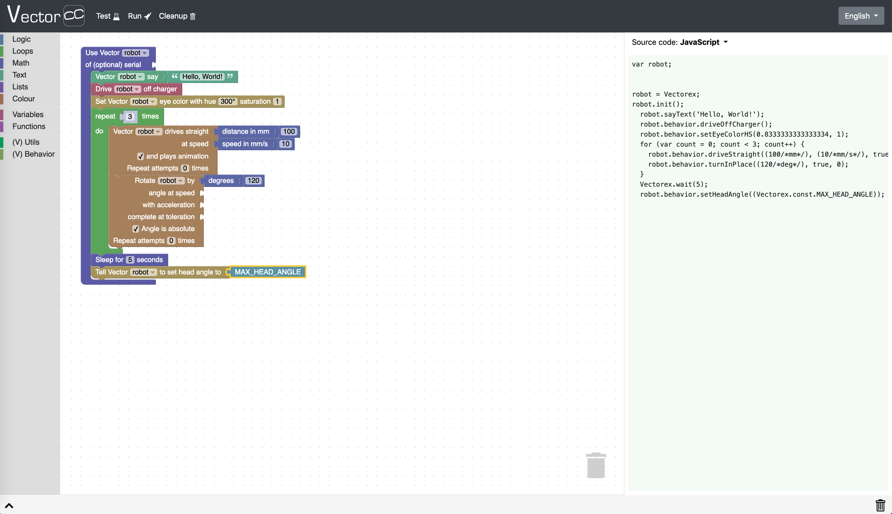
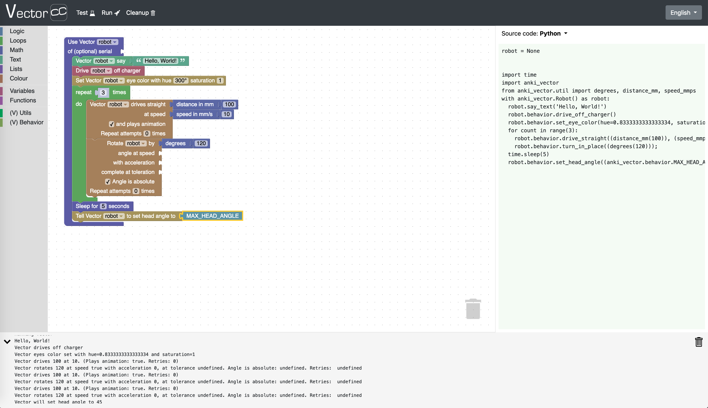

# Vector C2 

The idea behind Vector C2 is to enable those without (or with limited Python) programming experience to write simple scripts in form of Scratch-like blocks to control their Vector(s).

The user creates program in form of blocks. He can "test" it using JavaScript version of the code generated from those blocks. Finally, the user can "run" the Python version of the code on the server side, actually ordering Vector to do stuff.

Here is an example "code in blocks" using Vector API, with JavaScript code generated out of it.

The same example "code in blocks" with the actual Python code that will be run on the server side - making Vector to take actions; plus, an outcome of a "testing" procedure, i.e., running the JavaScript code of the blocks.

---

Copyright 2019 - Sebastian R. Kruk <vectorc2@kruk.me>